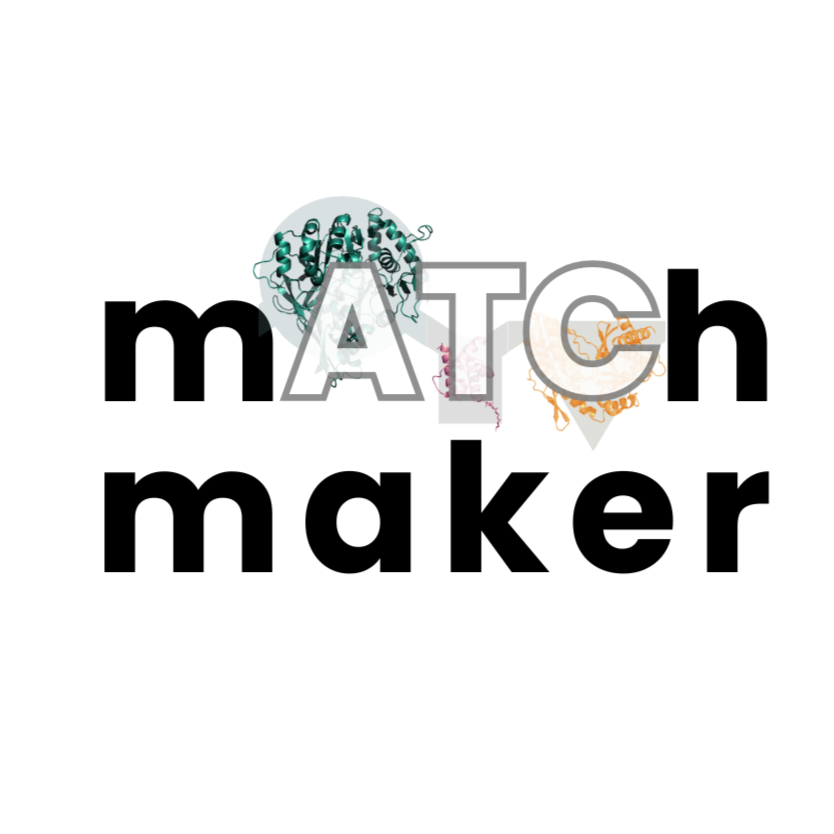

# mATChmaker

  

**mATChmaker** is a web platform for analyzing NRPS (non-ribosomal peptide synthetase) gene
clusters — from raw sequence or genome annotation all the way to substrate specificity
prediction and thioesterase domain comparison. It won **Best Software Tool at iGEM 2025**.

🔗 **Live app:** [nrps-matchmaker.mpi-marburg.mpg.de](https://nrps-matchmaker.mpi-marburg.mpg.de/)

## What it does

mATChmaker brings together several NRPS analysis workflows in one browser-based tool:

- **PARAS substrate prediction** — submit an amino acid sequence or a GenBank file to detect
  NRPS adenylation (A-) domains and predict which substrate each domain is specific to, powered
  by the [PARAS/PARASECT](https://github.com/BTheDragonMaster/parasect) prediction engine.
- **antiSMASH-based analysis** — submit antiSMASH output for automated extraction and annotation
  of NRPS biosynthetic gene clusters.
- **TTE (Thioesterase Terminal Extension) extraction and comparison** — extract TTE domains from
  annotated GenBank files and compare/search them against a reference database to find similar
  domains across gene clusters.
- **XU/XUT annotation** — annotate GenBank files with XU and XUT domain features.
- **Database browsing** — browse the underlying reference data (built from a MIBiG-derived
  schema) that predictions and comparisons are matched against.
- **Data annotation & curation** — submit new datapoints and edit/curate existing annotations
  through a dedicated annotation editor, to help improve future predictions.
- **Result export** — download analysis results generated by the above workflows.

The platform builds on [PARAS/PARASECT](https://github.com/BTheDragonMaster/parasect)
(Predictive Algorithm for Resolving A-domain Specificity featurising Enzyme and Compound in Tandem),
developed by Barbara Terlouw and David Meijer, and extends it with the TTE, antiSMASH, and XU/XUT
modules above plus a full web interface.

## About this repo

This is the **web application** version of mATChmaker. It supersedes the original
Docker/Jupyter-based CLI tool suite built for the iGEM 2025 wet-lab team,
[mATChmaker-iGEM-Marburg-2025](https://github.com/Jaisaiarun/mATChmaker-iGEM-Marburg-2025),
which ran locally and required a terminal-driven workflow. This version rebuilds the same core
analyses as a browser-based app, so no local setup or Python experience is needed to use it.

## Web application

Try it live at [nrps-matchmaker.mpi-marburg.mpg.de](https://nrps-matchmaker.mpi-marburg.mpg.de/),
or see [`app/README.md`](app/README.md) for instructions on running it locally or with Docker.

## Credits

- Built on [PARAS/PARASECT](https://github.com/BTheDragonMaster/parasect) by Barbara Terlouw and
  David Meijer, licensed under AGPLv3.
